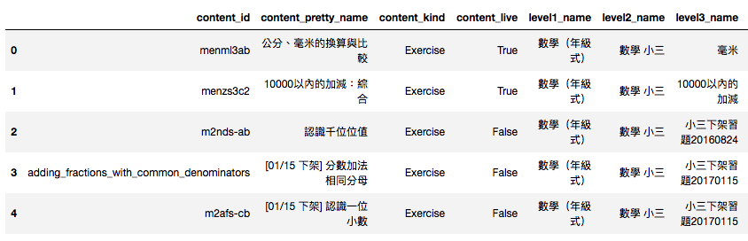

## BigOrm

本 package 真正處理 orm 的部份由 ibis 處理，目前主要在處理：

1. query code 跟 bigquery 的連接，方便使用
2. 把 impala 轉成 bigquery 吃的 SQL 2011 standard

兩個部分的功能。

--- 
安裝方式

```bash
pip install big-orm
```
<br><br>

使用方式，建構 big-orm object

```python
from big_orm import bq, orm

bqh = bq.BQHandler(project_id='{{ project_id }}', credential_path="{{ credential_path }}")
bqorm = orm.BQOrm(bq_handler=bqh)
```

<br><br>
然後就可以開始使用了，假設我要從一個 Table [IntegratedTable.Info\_Content] 裡面，特別找出三年級的數學練習題的資訊

```python
# 列出對象 table 的 bigquery 位置
info_content_addr = "IntegratedTable.Info_Content"

# 建構該 Table
info_content = bqorm.build_ibis_tb(info_content_addr)

# 針對該 Table 做處理
exercise_in_grade3 = info_content[(info_content.content_kind == "Exercise") & (info_content.level1_name == "數學（年級式）") & ((info_content.level2_name == "數學 小三"))]
```

<br><br>
基本上在使用 bqorm 建構完 ibis_table 之後(在上面的例子中為 info\_content)，之後的處理都是依循 [ibis 的 document](http://docs.ibis-project.org/sql.html#)。

處理完的結果，可以再藉由 bqorm 直接獲得結果，並轉為 pandas dataframe

```python
df = bqorm.get_df(exercise_in_grade3)
df.head()
```



<br><br>
如果你想看到產生的 query，可以使用 get_sql function

```python
sql= bqorm.get_sql(exercise_in_grade3)
print sql
```
這樣就可以看到 sql code

```sql
#standardSQL
SELECT *
FROM IntegratedTable.Info_Content
WHERE ((`content_kind` = 'Exercise') AND (`level1_name` = '數學（年級式）')) AND (`level2_name` = '數學 小三')
```

祝您使用愉快


